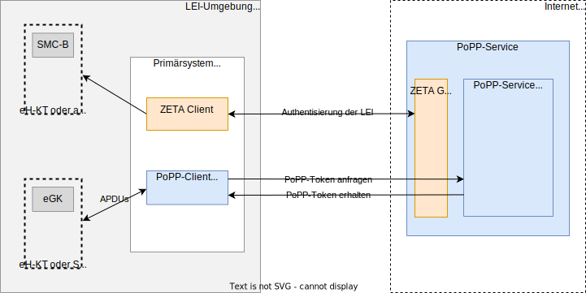

 

**Inhaltsverzeichnis**

<!-- TOC -->
* [Systemüberblick aus Sicht des Primärsystems](#systemüberblick-aus-sicht-des-primärsystems)
  * [Vorteile der Integration](#vorteile-der-integration)
  * [Betroffene logische Komponenten im Primärsystem](#betroffene-logische-komponenten-im-primärsystem)
    * [Logische Zerlegung der Primärsysteme](#logische-zerlegung-der-primärsysteme)
  * [Schnittstellen und Interaktionen](#schnittstellen-und-interaktionen)
  * [Ablauf im Versorgungskontext](#ablauf-im-versorgungskontext)
<!-- TOC -->

# Systemüberblick aus Sicht des Primärsystems

Ein ausführlicher Systemüberblick und die Darstellung der Versorgungsszenarien
und technischen Anwendungsfälle insgesamt ist
in [gemSpec_PoPP_Service](https://gemspec.gematik.de/prereleases/Draft_PoPP_25_1/gemSpec_PoPP_Service_V1.0.0_CC2/)
dargestellt.
Mit der Einführung des PoPP-Services werden alle dort genannten Systeme um neue
Komponenten und Funktionen erweitert, um den Nachweis des Versorgungskontexts
(PoPP) zu unterstützen und eine sichere, standardisierte Anbindung an die
Telematikinfrastruktur 2.0 zu gewährleisten.

Das Primärsystems wird um einen PoPP-Client erweitert.
Der PoPP-Client empfängt PoPP-Token vom PoPP-Service und stellt diese
kontextbezogen – etwa dem Patientenstammblatt, einem Kassenvorgang oder einem
Fall – innerhalb des Systems bereit.
Der PoPP-Token wird vom PoPP-Service ausgestellt, nachdem die Echtheit der eGK
geprüft und der Versorgungskontext erfolgreich bestätigt wurde.

_Hinweis: Die gematik stellt keinen produktiv nutzbaren PoPP-Client zur Verfügung._

Es gibt viele verschiedene Primärsysteme, weil jeder Bereich im
Gesundheitswesen andere Anforderungen hat.
Deshalb betrachten wir die Primärsysteme im Folgenden aus einer logischen
Perspektive.

Primärsystem (PS) ist der Oberbegriff für Softwaresysteme, die in
verschiedenen Leistungserbringerinstitutionen im deutschen Gesundheitswesen
eingesetzt werden.
Dazu zählen insbesondere:

1. PVS (Praxisverwaltungssystem): in Arztpraxen,
2. ZPVS (Zahnarztpraxisverwaltungssystem): in Zahnarztpraxen,
3. AVS (Apothekenverwaltungssystem): in öffentlichen Apotheken,
4. KIS (Krankenhausinformationssystem): in Krankenhäusern und Kliniken,
5. Pflegeverwaltungssysteme: in ambulanten und stationären Pflegeeinrichtungen.

Mit der Einführung des PoPP-Services werden alle diese Systeme um neue
Komponenten und Funktionen erweitert, um den Nachweis des Versorgungskontexts 
(PoPP) zu unterstützen und eine sichere, standardisierte Anbindung an die
Telematikinfrastruktur 2.0 zu gewährleisten.

## Vorteile der Integration

Durch die Integration der PoPP-Funktionalität in alle betroffenen Primärsysteme
wird ein einheitlicher, rechtssicherer und nachvollziehbarer
Nachweis der Patientenanwesenheit ermöglicht.
Gleichzeitig wird die Nutzung der neuesten TI-Fachdienste unterstützt und die
Systemarchitektur bleibt zukunftssicher und datenschutzkonform.

## Betroffene logische Komponenten im Primärsystem

Unabhängig vom konkreten Primärsystem müssen Sie 
folgende Komponenten für die PoPP-Lösung integrieren:

1. **PoPP-Client**:
   Verantwortlich für die fachliche Kommunikation mit dem PoPP-Service, z. B.
   Anforderung und Empfang von PoPP-Token sowie die Steuerung der
   Check-in-Prozesse für Versicherte (mit eGK oder GesundheitsID).
2. **ZETA Client**:
   Stellt die sichere, Zero-Trust-basierte Kommunikation zwischen dem
   Primärsystem
   und dem PoPP-Service sicher und authentisert dabei u.a. das PS bzw. die
   Institution (LEI) mittels SMC-B gegenüber dem Dienst.
3. **Anwendungs-Bausteine**:
   Steuern die Nutzung der TI-Fachdienste (z. B. ePA, E-Rezept, VSDM 2.0) und
   greifen auf die vom PoPP-Service bereitgestellten PoPP-Token zurück.
4. **PS-Basissoftware**:
   Hiermit ist die bisherige Software, das bisherige PS-Produkt gemeint. Je nach
   Sektor sind hier verschieden Anteile wichtig:
   1. **PVS** / **ZPVS** und **KIS:** 
      1. Zuordnung der empfangenen PoPP-Token zu einem Patienten / Klienten
      2. Steuerung von Aufrufen der TI-Fachdienste
   2. **AVS:** 
      1. Zuordnung der empfangenen PoPP-Token zu einem Kassenvorgang
      2. Steuerung von Aufrufen der TI-Fachdienste

### Logische Zerlegung der Primärsysteme

Die Abbildung "PS: Logische Zerlegung für PoPP" bietet einen allgemeinen
logischen Blick auf die Software-Struktur der Primärsysteme.

  

Für die Verwendung der PoPP-Lösung kommen neue Bausteine hinzu, darunter der
PoPP-Client, der als direkter Kommunikationspartner für den PoPP-Service im
PS fungiert.
Das PS nutzt den PoPP-Client, um PoPP-Token abzurufen und zu verwenden. 

Es muss im Primärsystem konfigurierbar sein, ob der PoPP-Token unmittelbar
nach Erstellung für die Authorisierung des LEI Zugriff auf weitere TI
Fachdienste verwendet wird oder ob dies durch einen manuellen Trigger erfolgt.
Ebenfalls neu ist der ZETA Client als direkter Kommunikationspartner von
ZETA Guard.
Über diesen erfolgt die Anmeldung und Registrierung des PS, bzw. der LEI.

Neben den Software-Bausteinen, die für die Unterstützung der TI-Anwendungen
notwendig sind, gibt es weitere, teilweise sektorspezifische Funktionalitäten,
wie Patientenverwaltung in PVS/ZPVS oder Fall-Verwaltung im KIS.

Die Gestaltung der Kommunikationswege zwischen den einzelnen Bausteinen
kann produktabhängig variieren und obliegt Ihrer Verantwortung.
Für die verschiedenen TI-Anwendungen gibt es jeweils spezifische
Software-Bausteine.

## Schnittstellen und Interaktionen

Es werden nur die im Kontext von PoPP relevanten Hard- und
Software-Schnittstellen erwähnt; Schnittstellen zu vorhandenen Ein- uns
Ausgabe-Geräten wie Drucker, Tastatur und Maus werden nicht beschrieben.

1. Schnittstelle [I_PoPP_Token_Generation.yaml][] zum PoPP-Service:
   Über diese Schnittstelle werden PoPP-Token angefordert und empfangen.
   Die Kommunikation erfolgt über den PoPP-Client und ist durch den ZETA Client
   abgesichert.
2. Schnittstellen zu TI-Fachdiensten:
   Die im PS integrierten Anwendungs-Bausteine nutzen die PoPP-Token, um der LEI
   einen autorisierten Zugriff auf die Daten von Versicherten, die in einem
   TI-Fachdienst liegen zu erhalten.
3. Schnittstellen zu Praxis IT
   1. Konnektor (SOAP) und eHealth-KT
   2. Standard-Kartenleser (PC/SC)
   3. weitere Ein- und Ausgabe-Geräte (Drucker, Maus, Tastatur)

## Ablauf im Versorgungskontext

1. Der Versicherte meldet sich bei der LEI an; es wird die eGK gesteckt
   (Standard-Kartenleser oder eHealth-KT).
2. Das Primärsystem initiiert über den PoPP-Client die
   Kommunikation mit dem PoPP-Service.
3. Der ZETA Client authentisiert das Primärsystem gegenüber dem PoPP-Service,
   falls dieser Schritt nicht schon zuvor durchlaufen wurde.
4. Nach erfolgreicher Authentifizierung und Prüfung wird vom PoPP-Service ein
   PoPP-Token erstellt und an den PoPP-Client übermittelt.
5. Der PoPP-Token wird vom PoPP-Client zur weiteren Verwendung innerhalb des
   Primärsystems übergeben.
6. Das PoPP-Token wird vom Primärsystem für den Zugriff auf TI-Fachdienste
   verwendet.

[I_PoPP_Token_Generation.yaml]:https://github.com/gematik/api-popp/blob/main/src/openapi/I_PoPP_Token_Generation.yaml
