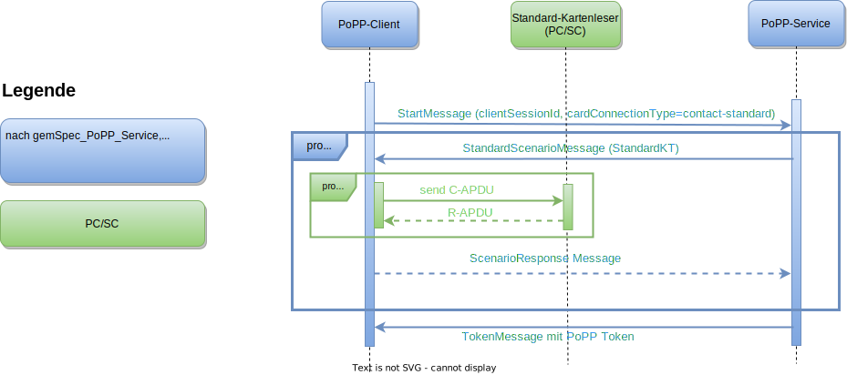

 

**Inhaltsverzeichnis**

<!-- TOC -->
* [Funktionsmerkmale des PoPP-Client](#funktionsmerkmale-des-popp-client)
  * [PoPP-Token Generierung](#popp-token-generierung)
    * [PoPP-Token mit Konnektor und eHealth Kartenterminal](#popp-token-mit-konnektor-und-ehealth-kartenterminal)
    * [PoPP-Token mit Standard-Kartenleser](#popp-token-mit-standard-kartenleser)
  * [Verwendung des ZETA Clients](#verwendung-des-zeta-clients)
  * [PoPP Beispielimplementierung](#popp-beispielimplementierung)
<!-- TOC -->

# Funktionsmerkmale des PoPP-Client

## PoPP-Token Generierung

In den folgenden Darstellungen wird die PoPP-Token Generierung zwischen PoPP-Client und PoPP-Service visualisiert. Unterschiede ergeben sich, ob die eGK mit Konnektor und eHealth Kartenterminal bzw. mit Standard-Kartenleser verwendet wird. 

Die Kommunikation mit dem ZETA Client wird hier nicht betrachtet.

Implementierungsdetails finden sich im Abschnitt zur [eGK](../docs/eGK/00_uebersicht.md).

### PoPP-Token mit Konnektor und eHealth Kartenterminal

### PoPP-Token mit Standard-Kartenleser

## Verwendung des ZETA Clients

Alles rund um die Abläufe und die Nutzung des ZETA Clients finden Sie in
der [ZETA Dokumentation][].

*Hinweis:* ZETA wird in diesem Dokument nicht behandelt.

## PoPP Beispielimplementierung

Mit der [gematik PoPP Beispielimplementierung][] bekommen Sie einen schnellen
und unkomplizierten Einstieg ins Thema. Sie sehen direkt im Quellcode an einem
praktischen Beispiel wie Sie

- die Schnittstelle zwischen PoPP-Client und PoPP-Service,
- die Anbindung eines Standard-Kartenlesers und
- die Verwendung der neuen Konnektormethoden
  implementieren könnten.

Das Beste: Sie können direkt ausprobieren, eigene Anpassungen vornehmen und so
besser verstehen, wie alles funktioniert.

[ZETA Dokumentation]:https://github.com/gematik/zeta/blob/main/docs/api/v1/index.md
[gematik PoPP Beispielimplementierung]:https://github.com/gematik/popp-sample-code
