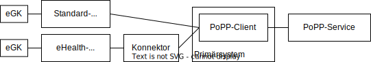

 

**Inhaltsverzeichnis**

<!-- TOC -->
* [Einordnung](#einordnung)
* [Übersicht](#übersicht)
<!-- TOC -->

# Einordnung

Wie schon an anderer Stelle beschrieben enthält ein PoPP-Token aus Sicht der
Nutzer im Wesentlichen folgende Information:  
_Leistungserbringer X versorgt den Versicherten Y._

Dazu enthält das PoPP-Token die Telematik-ID des Leistungserbringers X sowie die
[KVNR][] des Versicherten Y.
In [gemSpec_PoPP_Service][] werden verschiedene Wege aufgezeigt, wie die
Telematik-ID einerseits und die KVNR andererseits in ein PoPP-Token gelangen.
Dieses Dokument und seine Unterdokumente fokussieren auf den Weg der KVNR
von einer eGK über den PoPP-Client als Teil des [Primärsystems][] hin zum
PoPP-Service.
Insbesondere werden hier die Aufgaben des PoPP-Clients beschrieben.

# Übersicht

Anders als im [Systemüberblick](../10_systemueberblick.md) wird in diesem 
Dokument und seinen Unterdokumenten aus Gründen der Übersichtlichkeit eine 
vereinfachte Systemsicht verwendet, welche lediglich die Komponenten enthält,
die für die hier betrachtete Aufgabe wesentlich sind.
Zudem wird hier nur der Gutfall behandelt.
Fehlerfälle werden [hier](90_fehler.md) behandelt.

Aus Sicht des PoPP-Clients stellt sich seine hier betrachtete Aufgabe wie
folgt dar:

1. [eGK-stecken](10_egk-stecken.md):
   Eine eGK wird in ein Kartenlesegerät eingesteckt.
   Der PoPP-Client wird darüber benachrichtigt, dass eine eGK gesteckt wurde,
   mit dem Ziel, diese für den Abruf eines PoPP-Tokens zu nutzen.
2. [Verbindung herstellen](20_WebSocket.md):
   Der PoPP-Client stellt eine Verbindung mit dem PoPP-Service her.
3. [Bearbeitung von Szenarion](30_scenario.md):
   Der PoPP-Service schickt dem PoPP-Client eine Reihe von _Scenarios_.
   Abschließend erhält der PoPP-Client das angefragte PoPP-Token.

_Hinweis: Der Einfachheit halber wird hier und im Folgenden stets nur vom 
"Stecken" einer eGK gesprochen.
Das schließt den Fall mit ein, dass die eGK 
konktatklos an ein Kartenlesegerät angebunden ist.
Vielfach werden bei kontatkloser Kommunikation Karten nicht "gesteckt", 
sondern auf der Landefläche des Kartenlesegerätes abgelegt.
Zudem ist es üblich in solchen Fällen eine kontaktlos angebundene Karte in 
ein Fach "zu stecken", wenn der Vorgang länger dauert (einige Sekunden).
So ein Fach gewährleistet, dass die kontaktlos angebundene Karte sicher auf 
der Landefläche des Kartenlesegerätes verbleibt._

[KVNR]:https://www.gkv-datenaustausch.de/kvnr/kvnr.jsp

[Primärsystems]:https://fachportal.gematik.de/hersteller-anbieter/primaersysteme

[gemSpec_PoPP_Service]:https://gemspec.gematik.de/prereleases/Draft_PoPP_25_1/gemSpec_PoPP_Service_V1.0.0_CC2/
